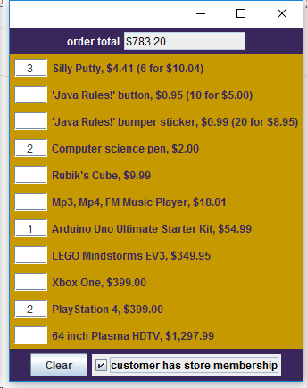

# Shopping Cart
### TCSS 305 Programming Prcticum

This assignment is about to practice writing Java classes to a provided API and using Collections. The purpose was to 
write a set of supporting classes for a simple shopping cart. The instructor has provided the Graphical User 
Interface (GUI) that will provide the "front end" or "view" to your program. My goal was to write the back end of the programm.    
[Full assagnment description.](https://www.dropbox.com/s/rnixz35c1y0zf3p/hw2-shoppingcart.pdf?dl=0)

### Example

